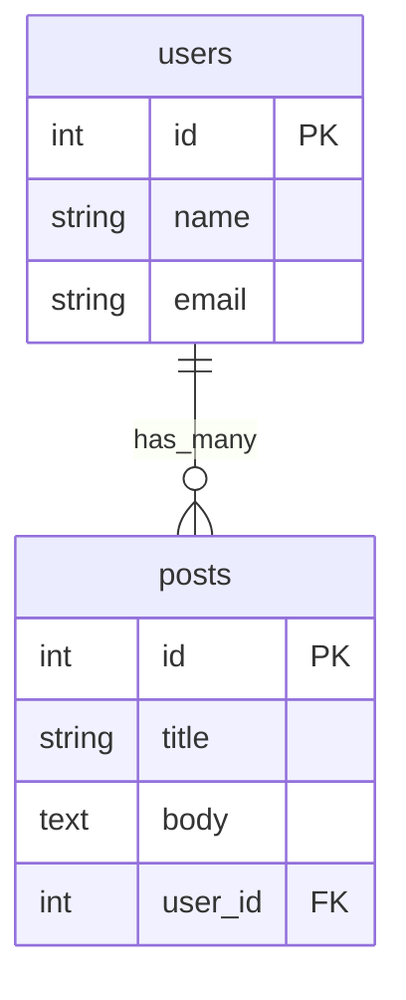

```mermaid
erDiagram
    users {
        int id PK
        string name
        string email
    }

    posts {
        int id PK
        string title
        text body
        int user_id FK
    }

users ||--o{ posts : has_many
```