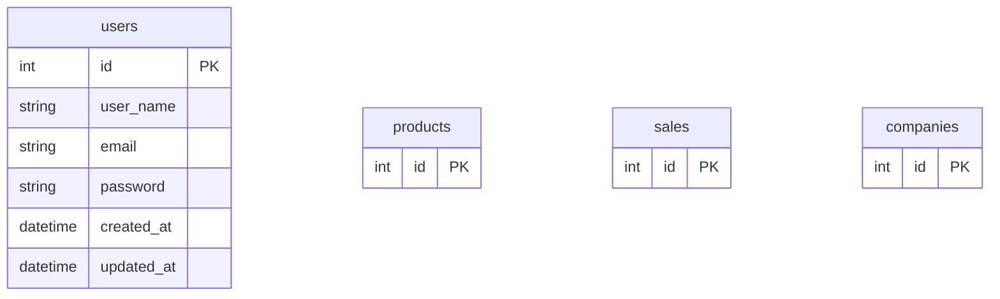

```mermaid
erDiagram
    users {
        int id PK
        string user_name
        string email
        string password
        datetime created_at
        datetime updated_at
    }

    products {
        int id PK
    }

    sales {
        int id PK
    }

    companies {
        int id PK
    }
```