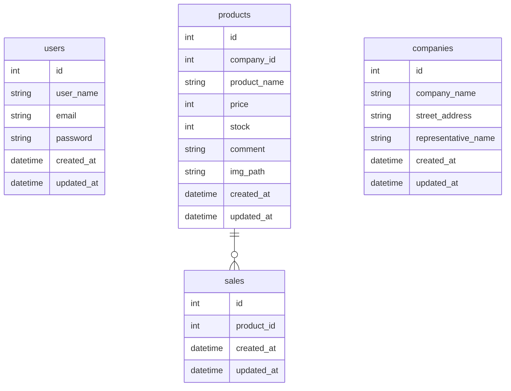

```mermaid
erDiagram

users {
    int id
    string user_name
    string email
    string password
    datetime created_at
    datetime updated_at
}

products {
    int id
    int company_id
    string product_name
    int price
    int stock
    string comment
    string img_path
    datetime created_at
    datetime updated_at
}

sales {
    int id
    int product_id
    datetime created_at
    datetime updated_at
}

companies {
    int id
    string company_name
    string street_address
    string representative_name
    datetime created_at
    datetime updated_at
}

products ||--o{ sales : ""
```